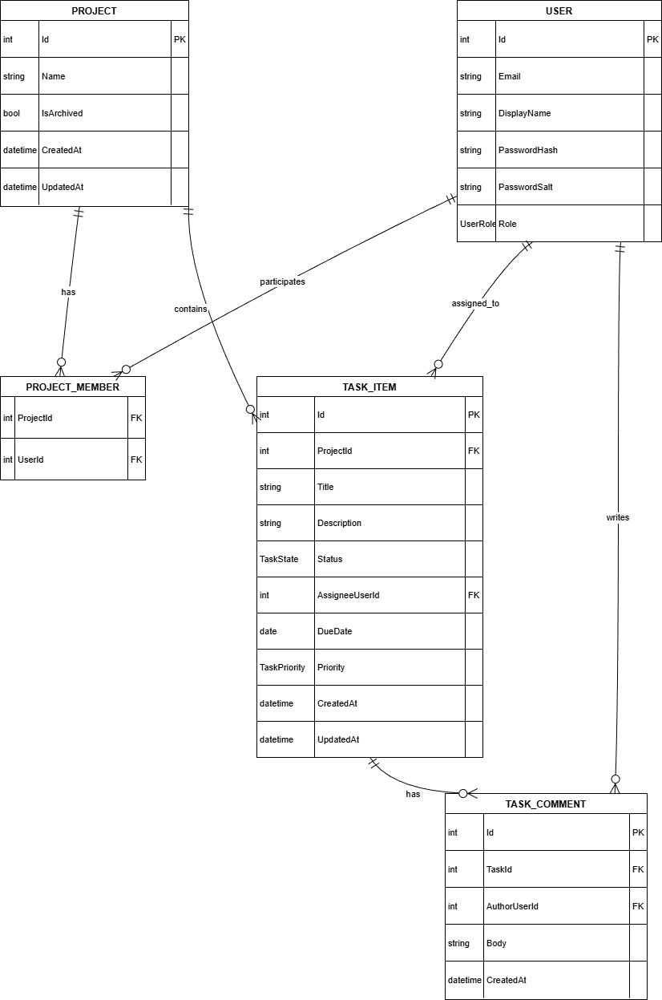

# 案件タスク管理 Lite（Backend / API）

案件・タスク管理を行う Web アプリケーションの **バックエンド API** です。  
業務利用を想定し、**状態遷移ルール・権限制御・データ整合性** を重視した設計としています。

---

## 🔗 公開エンドポイント（デモ）

- API Base  
  https://taskstsv-be-cacjavgfebh2bucp.japaneast-01.azurewebsites.net

- Health Check  
  https://taskstsv-be-cacjavgfebh2bucp.japaneast-01.azurewebsites.net/health

- Swagger（OpenAPI）  
  https://taskstsv-be-cacjavgfebh2bucp.japaneast-01.azurewebsites.net/swagger/index.html

---

## 🔗 関連リポジトリ
- Frontend（Next.js）: https://github.com/fewioaghwrao/TaskStatusTransitionValidation-Front

---

## 📌 設計方針

- **状態遷移ルールはサーバー側で一元管理**
- **権限（Leader / Member）をAPIレイヤーで制御**
- 業務アプリを想定した **バリデーション・例外設計**
- フロントエンドと疎結合な REST API
- 将来的な機能拡張（監査ログ等）を考慮した構成

---

## 🧩 システム構成（概要）

```bash
[ Frontend (Next.js) ]
|
| HTTPS (REST API)
v
[ Backend (ASP.NET Core Web API) ]
|
v
[ Database ]
```

- フロントエンドから直接 API を呼び出す構成
- 認証はトークンベース
- Health エンドポイントによる死活監視対応

---

## 🗂 ドメインモデル / ER図



### 主なエンティティ

- **User**
  - ユーザー情報
  - ロール（Leader / Member）

- **Project**
  - 案件（プロジェクト）
  - アーカイブ状態管理

- **Task**
  - タスク本体
  - 状態・期限・優先度・担当者

---

## 🔁 タスク状態遷移設計

### ステータス定義
- `ToDo`
- `Doing`
- `Blocked`
- `Done`

### 許可される遷移
- ToDo → Doing / Blocked
- Doing → Blocked / Done
- Blocked → Doing
- Done → （変更不可）

※ **不正な遷移は API 側で検証し、400 エラーを返却**

---

## 👤 権限設計（APIレベル）

| 機能 | Leader | Member |
|---|---|---|
| 案件作成 | ○ | × |
| 案件アーカイブ | ○ | × |
| タスク作成 | ○ | ○ |
| 担当者指定 | ○ | × |
| 状態変更 | ○ | ○ |
| CSV出力 | ○ | ○ |

---

## 🔌 API概要（主要）

### 認証
- `POST /api/v1/auth/login`
- トークン発行方式

### 案件
- `GET /api/v1/projects`
- `POST /api/v1/projects`
- `PATCH /api/v1/projects/{id}/archive`

### タスク
- `GET /api/v1/projects/{id}/tasks`
- `POST /api/v1/tasks`
- `PATCH /api/v1/tasks/{id}`
- `GET /api/v1/tasks/export`（CSV）

※ 詳細は Swagger を参照

---

## 📄 CSV出力仕様（概要）

- 文字コード：UTF-8  
- 区切り：カンマ  
- 出力列：  
  案件名 / タスク名 / 状態 / 優先度 / 期限 / 担当者 / 作成日時 / 更新日時

---

## ⚠ エラー・バリデーション設計

- 入力不備・権限不足・不正遷移は **400 / 403** で返却
- 業務的に起こりうるエラーは例外メッセージを明示
- フロント側で判別しやすいレスポンス構造を採用

---

## 🛠 技術スタック（バックエンド）

- ASP.NET Core Web API
- C#
- Entity Framework Core
- DB：SQL Server（実運用/デモ）
- Swagger（OpenAPI）
- Azure App Service（Linux）

---

## 🔧 ローカル起動（概要）

```bash
dotnet restore
dotnet run
```
※ 接続先DBやCORS設定は環境変数で切替

---

## 今後の拡張構想
- 操作ログ（監査対応）
- タスクコメント
- 状態遷移ルールの設定化
- Webhook / 外部連携

---

## 補足
本APIは「画面を作るためのAPI」ではなく、
業務ルールと整合性を保証するバックエンドを意識して設計しています。